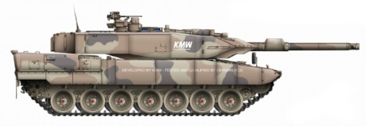

# Leopard

STM32F103ZET6 evaluation board support package base on HAL/LL libraries.



## Project Structure

```cmd
Leopard:.
├─.settings
├─Core
│  ├─Inc
│  ├─Src
│  └─Startup
├─Debug
│  ├─Core
│  │  ├─Src
│  │  └─Startup
│  └─Drivers
│      └─STM32F1xx_HAL_Driver
│          └─Src
├─Drivers
│  ├─CMSIS
│  │  ├─Device
│  │  │  └─ST
│  │  │      └─STM32F1xx
│  │  │          ├─Include
│  │  │          └─Source
│  │  │              └─Templates
│  │  └─Include
│  └─STM32F1xx_HAL_Driver
│      ├─Inc
│      │  └─Legacy
│      └─Src
├─Images
└─Release
    ├─Core
    │  ├─Src
    │  └─Startup
    └─Drivers
        └─STM32F1xx_HAL_Driver
            └─Src
```
